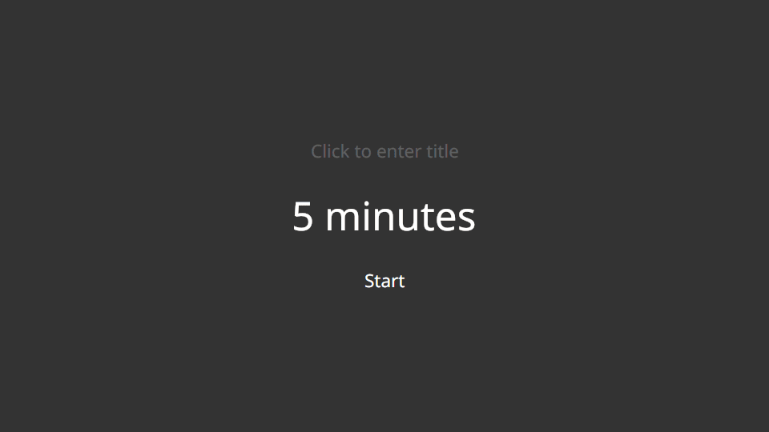

# Hourglass Linux

The simple countdown timer originally for Windows, now on Linux.

Visit [chris.dziemborowicz.com](http://chris.dziemborowicz.com/apps/hourglass/) to learn more about the original project.



## Requirements

- .NET 10 SDK. This repository is pinned to SDK `10.0.108` in `global.json` with `rollForward` set to `latestFeature`.
- Linux desktop runtime dependencies required by Avalonia.
- Network access for the first NuGet restore.

## Build And Test

Use the modern Linux solution for current Linux development:

```bash
dotnet restore Hourglass.Linux.sln
dotnet build Hourglass.Linux.sln --configuration Release --no-restore
dotnet test Hourglass.Linux.sln --configuration Release --no-build --verbosity normal
```

The legacy Windows solution remains available as `Hourglass.sln`, but Linux port work should use `Hourglass.Linux.sln`.

## Run Locally

Run the Avalonia Linux app from a graphical Linux desktop session:

```bash
dotnet run --project src/Hourglass.Linux.Avalonia/Hourglass.Linux.Avalonia.csproj
```

Right-click the timer surface to open timer actions and persistent notification, sound, and always-on-top options.
The **About Hourglass** item shows version/build details, repository and developer links, original Hourglass
attribution, MIT license information, and copyable diagnostic metadata for support reports.
Settings are stored in `hourglass-linux/app.json` under `$XDG_CONFIG_HOME`, or under `~/.config` when
`XDG_CONFIG_HOME` is not set. Always-on-top uses Avalonia's standard `Topmost` window hint; some Wayland
compositors may ignore that hint.

## Regenerate The README Demo

Requirements:

- .NET 10 SDK.
- FFmpeg.
- Normal repository restore dependencies.

Generate the README GIF and MP4:

```bash
./scripts/record-readme-demo.sh
```

Advanced direct invocation:

```bash
dotnet run \
  --configuration Release \
  --project tools/Hourglass.DemoRecorder/Hourglass.DemoRecorder.csproj \
  -- \
  --scenario readme
```

The recorder uses Avalonia headless rendering with isolated in-memory platform services. It does not read or modify normal Hourglass settings.

## Restricted Environments

If the local environment blocks writes under the default .NET CLI home, prefix the commands with a writable CLI home:

```bash
DOTNET_CLI_HOME=/tmp/hourglass-dotnet-home dotnet restore Hourglass.Linux.sln
DOTNET_CLI_HOME=/tmp/hourglass-dotnet-home dotnet build Hourglass.Linux.sln --configuration Release --no-restore
DOTNET_CLI_HOME=/tmp/hourglass-dotnet-home dotnet test Hourglass.Linux.sln --configuration Release --no-build --verbosity normal
```
