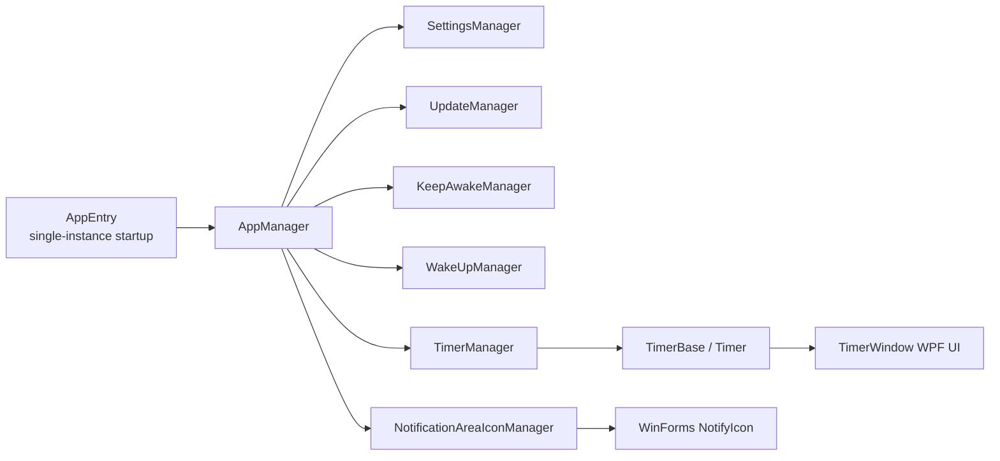
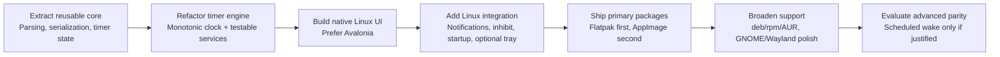

# Porting Hourglass to Linux

## Executive summary

Hourglass is not a generic .NET desktop app that can simply be recompiled for Linux. The publicly available code and project files show a classic Visual Studio 2013 solution built around a Windows Presentation Foundation UI, a .NET Framework 4.8 runtime configuration, WinForms notification-area integration, Microsoft.VisualBasic single-instance startup logic, and native Windows behaviors for keeping the machine awake and scheduling wake-from-sleep timers. The official site currently lists Hourglass 1.15, published on June 20, 2024, with both installer and portable downloads, and links to the public source repository. citeturn0search4turn43view0turn38view5turn46view1turn16view1turn12view5turn14view1turn19search18

The best long-term Linux strategy is a **native port that preserves the app’s non-UI logic** and replaces the Windows UI/integration layer. In practical terms, that means reusing the parsing, timer-state, serialization, and options-management code where possible, while replacing WPF windows, `DispatcherTimer`, `NotifyIcon`, sleep inhibition, startup integration, and Windows-specific update/installer behavior. Among realistic toolkit choices, **Avalonia is the lowest-friction path** because it preserves C# and XAML skills and supports Linux desktop targets on both X11 and Wayland; a full Qt or GTK rewrite is feasible, but it costs more and reuses less of the existing stack. citeturn46view5turn39view1turn35view2turn36view1turn19search5turn19search10turn19search18

A **Wine-based compatibility path** is viable only as a stopgap. Wine Mono is intended as a replacement for .NET Framework 4.8.1 and earlier in Wine, and Wine maintains a Core WPF fork, but compatibility is app-specific and must be validated empirically rather than assumed. For Hourglass, the highest-risk areas under Wine are precisely the features that matter most to users: notification area behavior, focus/activation, suspend/wake behavior, and notifications across GNOME, KDE, XFCE, Cinnamon, MATE, Wayland, and X11. citeturn30search0turn31search15turn31search1turn22search6turn22search3turn23search10

**Containerization is not a port by itself.** Flatpak, Snap, and AppImage are packaging and distribution layers. They are valuable, but they do not make WPF cross-platform. Once Hourglass has a native Linux build, Flatpak is the strongest primary distribution target because it is cross-distro, sandboxed, and integrated with portals for notifications, background activity, and inhibition. Snap adds strong confinement and built-in auto-refresh behavior. AppImage is the easiest one-file upstream artifact, but AppImage itself is chiefly a distribution format rather than the sandbox. citeturn19search18turn27search0turn24search20turn24search1turn25search0turn26search0turn27search1turn41search0turn41search7turn27search2

Using conservative engineering assumptions, a **minimal viable Linux port** is roughly **120–220 person-hours**, a **full-feature parity port** is roughly **280–450 hours**, and a **polished native release across major desktop environments and package formats** is roughly **500–800 hours**. The biggest technical product decision is whether Linux must also wake the machine from suspend at a scheduled time. Hourglass currently does that on Windows with waitable timers configured to resume the machine; in the Linux desktop documentation reviewed here, I found standardized APIs for notifications, background permissions, and session inhibition, but not an equivalent cross-desktop high-level wake-at-time API. My recommendation is therefore: **build a native Linux port, ship notifications and optional tray support first, and defer scheduled machine wake-up to a later distro-specific backend or omit it from the initial Linux release.** citeturn14view1turn14view2turn24search20turn25search0turn26search0

## Current application inventory

Because Hourglass’s source is public, the inventory below is based primarily on the repository’s project files and code rather than reverse-engineering binaries. That is a major advantage: the current Windows coupling is explicit, and the likely Linux refactoring boundaries are visible in the code structure. citeturn0search4turn43view0turn46view5

| Area | Finding |
|---|---|
| Official release state | The official site currently lists **Hourglass 1.15**, published **June 20, 2024**, and offers both an **installer** and a **portable app** download, with source code linked publicly. citeturn0search4 |
| Source availability | Source is publicly available in a GitHub repository, so this is **not** a source-unavailable black-box assessment. citeturn0search4turn43view0 |
| Languages and UI | The main project is written in **C#** and includes multiple **XAML** pages such as `TimerWindow.xaml`, `UsageDialog.xaml`, and `AboutDialog.xaml`; the project references `PresentationCore`, `PresentationFramework`, `System.Xaml`, and `WindowsBase`, which identifies it as a **WPF** desktop app. citeturn46view1turn46view4turn46view5 |
| Runtime/framework | `App.config` declares `.NETFramework,Version=v4.8`, and Microsoft’s WPF documentation states that WPF remains **Windows-only**, even on modern .NET. In other words, “just migrate from .NET Framework to .NET 8/10” would **not** make the current UI portable to Linux. citeturn38view5turn19search18turn19search0 |
| Additional framework dependencies | The main project also references **`Microsoft.VisualBasic`**, **`System.Windows.Forms`**, **`System.Drawing`**, and **`System.Management`**, indicating a mixed WPF/WinForms/desktop-framework stack rather than a self-contained cross-platform .NET UI codebase. citeturn46view1turn46view2turn46view3 |
| Build system | The solution file is **Visual Studio 2013 format**, and the projects are classic **MSBuild** project files rather than modern SDK-style projects. The solution contains four projects: `Hourglass`, `Hourglass.Test`, `Hourglass.Setup`, and `Hourglass.Bundle`. citeturn43view0turn17view0turn17view1 |
| Test project | The repository already has a **test project**, but it is narrow and legacy: `Hourglass.Test` targets **.NET Framework 4.8**, uses **Microsoft.VisualStudio.QualityTools.UnitTestFramework**, and currently compiles only `DateTimeTokenTest.cs` and `TimeSpanTokenTest.cs`. That is useful, but it is far from the breadth needed for a Linux port. citeturn44view0turn45view0turn45view3 |
| Installer type | The Windows installer is built with **WiX**. `Hourglass.Setup.wixproj` produces a **Package**, `Product.wxs` defines a **per-machine MSI** under `ProgramFilesFolder`, and `Bundle.wxs` wraps that MSI in a WiX **bootstrapper bundle**. citeturn18view0turn18view2turn18view6turn18view7 |
| Runtime bootstrapper | The WiX bundle explicitly chains **`NetFx48Web`** before the MSI, confirming that the Windows installer bootstraps the .NET Framework rather than shipping a Linux-portable runtime model. citeturn18view6turn18view7 |
| Portable build signals | The solution defines `Debug Portable`, `Release Portable`, and `Signed Portable` configurations, which matches the official site’s portable download option. citeturn43view0turn0search4 |
| Settings and persistence | The settings files show persisted user data for timer info, recent options, themes, window size, notification-area preference, 24-hour preference, and a persistent **`UniqueId`**. `SettingsManager` upgrades and saves those settings. citeturn38view2turn38view3turn38view5turn37view0 |
| Update mechanism | `UpdateManager` fetches XML update metadata from `https://updates.dziemborowicz.com/hourglass`, uses `HttpWebRequest`, tries TLS 1.2/TLS 1.3, and includes **OS version**, **app version**, and the app’s persistent **UUID** in the User-Agent string. That is a packaging and privacy concern for Linux. citeturn15view3turn15view0turn15view5turn38view3 |

The code layout is also telling. The solution separates parsing, serialization, timing, managers, and window code. That is exactly what you want to see before a port: it suggests that a substantial portion of Hourglass’s non-visual logic can be extracted into a platform-neutral library, while the WPF windows and OS integration can be replaced. citeturn46view5turn39view1turn39view2turn39view4turn39view5

The current Windows-specific surface is concentrated in a few high-impact places:

| Windows-coupled feature | Evidence in current code | Porting consequence |
|---|---|---|
| Core timekeeping model | `TimerBase` owns a **WPF `DispatcherTimer`** and recomputes timer state from **`DateTime.Now`** on each update. citeturn35view2turn35view7 | The UI refresh loop and the actual timing model should be separated on Linux. A Linux-native port should ideally use a monotonic clock for countdown accuracy and suspend/resume resilience. |
| Notification area and balloon tips | `NotificationAreaIcon` uses **WinForms `NotifyIcon`**, context menus, and **`ShowBalloonTip()`**. citeturn36view0turn36view1 | Linux needs a different abstraction: freedesktop notifications, optional StatusNotifierItem tray integration, and a fallback when no tray exists. |
| Keep-awake behavior | `KeepAwakeManager` calls **`SetThreadExecutionState`** with flags to keep the display and system awake. citeturn12view5turn12view6 | Replace with a Linux inhibitor abstraction, ideally via toolkit/portal/session-manager APIs. |
| Wake machine before timer expiry | `WakeUpManager` creates a Windows **waitable timer** and calls **`SetWaitableTimer(..., fResume=true)`** to wake the machine. citeturn14view0turn14view1turn14view2 | This is the hardest parity item on Linux because it has no obvious cross-desktop high-level equivalent in the desktop docs reviewed here. |
| Single-instance startup and command-line handoff | `AppEntry` inherits **`WindowsFormsApplicationBase`**, sets `IsSingleInstance = true`, and handles `OnStartupNextInstance`. citeturn16view0turn16view1turn16view3 | Linux needs a different single-instance approach, usually a toolkit-specific app instance lock, D-Bus activation, or a user-session socket. |
| Bring-to-front behavior | `TimerWindow` uses `Topmost` toggling to bring the window forward and can **hide to the notification area**. citeturn40view0 | That behavior is much less predictable under Wayland and in tray-hostile environments such as GNOME defaults. |
| Update identity | Settings persist a **`UniqueId`**, and update checks transmit a **UUID** and OS-version data. citeturn38view3turn15view0 | Linux packaging should disable the Windows-style in-app updater and reconsider persistent identifiers entirely. |

The current architecture can be summarized like this:



That shape is actually good news. The port is difficult because of the UI and integration layers, not because the entire codebase is fundamentally unstructured. citeturn39view2turn35view2turn36view1turn16view1

## Porting paths

The first strategic point is crucial: **containerization does not solve the WPF problem**. Flatpak, Snap, and AppImage package applications, but the current Hourglass UI stack is still WPF, and Microsoft explicitly documents WPF as Windows-only. So the real porting choices are: **Wine**, **native port preserving logic**, or **full rewrite**. Container formats become important after that choice, not before. citeturn19search18turn27search14turn26search19turn41search7

The second strategic point is that **the current codebase is heterogeneous**: some of it is reusable, some of it is not. Reusable candidates include parser/token logic, timer-state models, theme/timer serialization, and much of the options/state management. Non-reusable or heavily reworked components include the WPF windows, `DispatcherTimer`-driven timing, tray integration, Windows single-instance startup, Windows power APIs, and the Windows-oriented update/install story. citeturn46view5turn35view2turn36view1turn16view1turn12view5turn14view1turn15view3

### Comparison of the main approaches

| Approach | Initial effort | Compatibility across Linux desktops | Ongoing maintenance | User experience | Performance | Security posture | Distribution complexity |
|---|---|---|---|---|---|---|---|
| **Wine only** | Low | Low to medium; app-specific and fragile | Medium to high | Usually acceptable only for enthusiasts | Moderate | Weaker than a sandboxed native build | Medium |
| **Wine bundled inside a universal package** | Low to medium | Low; adds another abstraction layer | High | Usually poor; feels non-native | Moderate to lower | Mixed; packaging can sandbox, but app stack remains Windows-in-Wine | High |
| **Native port preserving C# core** | Medium | High, if DE-specific fallbacks are implemented | Medium | Good to very good | Good | Strong, especially with Flatpak or well-scoped distro packages | Medium |
| **Full rewrite in Qt/GTK/Rust/etc.** | High | High, with enough QA | Medium to high | Potentially best | Good to very good | Strong | High |

These ratings synthesize the hard constraints in the sources: WPF is Windows-only; Wine compatibility is app-specific; Linux tray support is spec-driven and desktop-dependent; Wayland activation is compositor-mediated; and Flatpak/Snap/AppImage are packaging layers rather than UI portability layers. citeturn19search18turn30search0turn31search1turn22search6turn22search3turn27search0turn27search1turn41search7

**Native port preserving C# core.** This is the option I recommend. The least disruptive version of it is an **Avalonia-based port**: Avalonia is a cross-platform .NET UI framework that preserves C#/XAML development patterns and supports Linux desktops on X11 and Wayland. Avalonia also draws its own controls, which makes behavior more consistent across distributions. The trade-off is that it is not a recompilation of WPF; it is still a UI migration. But it is a much smaller conceptual jump than rewriting the app in C++/QML or GTK C/Rust bindings. citeturn19search5turn19search10turn19search12

For this path, the first code move should be architectural: extract **`Parsing`**, **`Serialization`**, **`Timing`**, and the option/state models into a platform-neutral library, then define service interfaces for notifications, tray support, startup integration, inhibition, wake alarms, audio playback, and settings storage. That keeps the migration honest: Windows-specific code becomes clearly isolated instead of leaking into the Linux UI. citeturn46view5turn39view2turn35view2

The most important low-level refactor is the timer engine. The current implementation is tied to `DispatcherTimer` and `DateTime.Now`, which is fine for a Windows WPF app but suboptimal for Linux parity because local wall clocks can jump when the user changes the clock, NTP steps time, or DST boundaries are crossed. On Linux I would treat **monotonic elapsed time** as the countdown truth and wall-clock time as presentation data or for absolute “alarm-at” scheduling only. That reduces drift and makes suspend/resume testing far easier. citeturn35view2turn35view7

```csharp
public interface IClock
{
    DateTimeOffset WallNow { get; }
    TimeSpan MonotonicNow { get; }
}

public sealed class CountdownEngine
{
    private readonly IClock _clock;
    private TimeSpan? _duration;
    private TimeSpan? _startedAtMono;
    private TimeSpan _pauseOffset;

    public CountdownEngine(IClock clock) => _clock = clock;

    public void Start(TimeSpan duration)
    {
        _duration = duration;
        _startedAtMono = _clock.MonotonicNow;
        _pauseOffset = TimeSpan.Zero;
    }

    public void Pause()
    {
        if (_startedAtMono is null || _duration is null) return;
        _pauseOffset = Elapsed;
        _startedAtMono = null;
    }

    public void Resume()
    {
        if (_duration is null || _startedAtMono is not null) return;
        _startedAtMono = _clock.MonotonicNow - _pauseOffset;
    }

    public TimeSpan Elapsed =>
        _startedAtMono is null ? _pauseOffset : _clock.MonotonicNow - _startedAtMono.Value;

    public TimeSpan Remaining =>
        _duration is null ? TimeSpan.Zero : TimeSpan.Max(_duration.Value - Elapsed, TimeSpan.Zero);
}
```

The notification/tray abstraction should also be redesigned from day one. The freedesktop Notifications specification explicitly lists a **scheduled alarm** as a core use case, so Linux notifications are a natural fit for Hourglass. But GNOME’s own developer documentation warns that notifications can be disabled and should not be relied on exclusively. That means the Linux UX should be “notification plus recoverable app state,” not “notification only.” citeturn21search3turn20search9turn24search1

```csharp
public interface IUserAttentionService
{
    bool HasTray { get; }
    Task NotifyTimerExpiredAsync(string title, string body);
    void UpdateActiveTimers(IEnumerable<string> labels);
    Task ShowMainWindowAsync();
}
```

On Linux, “keep awake” has a reasonable cross-desktop answer: use the **Inhibit portal** where possible, or toolkit/session-manager wrappers that ultimately map to it. The XDG Desktop Portal documentation explicitly exposes inhibition of suspend, idle, logout, and user switching, and GTK’s portal guidance recommends `gtk_application_inhibit()` for this purpose. That makes keep-awake a realistic parity item. citeturn25search0turn25search12turn25search6

```csharp
public interface ISessionInhibitor
{
    ValueTask<IAsyncDisposable?> AcquireAsync(
        string reason,
        bool inhibitSuspend,
        bool inhibitIdle);
}
```

The one Linux feature I would **not** promise in the MVP is “wake the sleeping machine at an exact time.” On Windows, Hourglass implements that explicitly with `CreateWaitableTimer` and `SetWaitableTimer(..., fResume=true)`. In the Linux desktop stack reviewed here, I found portal APIs for **notifications**, **background login-start permissions**, and **session inhibition**, but I did **not** find a cross-desktop high-level wake-at-time API. That does not mean Linux wake alarms are impossible; it means they likely require distro-, privilege-, or service-specific work and should be treated as an advanced feature rather than a baseline promise. That is an inference from the reviewed desktop APIs, and it is the single biggest functional risk in a parity port. citeturn14view1turn14view2turn24search20turn25search0turn26search0

```csharp
public interface IWakeAlarmService
{
    Task<WakeAlarmResult> TryScheduleAsync(DateTimeOffset at);
}

public readonly record struct WakeAlarmResult(bool Supported, string Message);
```

**Compatibility layer with Wine.** This path minimizes code change but maximizes uncertainty. Hourglass today is a Windows app targeting .NET Framework 4.8, and Wine Mono is intended as a replacement for .NET Framework 4.8.1 and earlier in Wine. Wine also tracks a Core WPF fork. So “can it launch?” is plausible. “Can it behave like a first-class Linux timer app everywhere?” is a different question. citeturn38view5turn30search0turn31search15

What makes Wine especially weak for Hourglass is not raw CPU performance; the app is lightweight. The weakness is integration quality. Hourglass depends on tray presence, message delivery, single-instance behavior, focus changes, power-management semantics, and Windows timer APIs that assume Windows shell and power infrastructure. Even if a Wine prefix runs the executable, the resulting user experience across GNOME Wayland, KDE Plasma Wayland, X11 sessions, and tray-hostile default environments is likely to be inconsistent. I would regard Wine as an **unsupported or lightly supported stopgap**, not the real Linux product. citeturn16view1turn36view1turn14view1turn22search3turn23search10

**Containerized delivery.** Flatpak, Snap, and AppImage are valuable once there is a native Linux build. If you tried to use them as the “port” for the existing Windows binary, you would merely be shipping a Windows app inside Wine inside a Linux packaging system. That is support-heavy and hard to justify for a timer utility. For native code, however, containerized delivery is excellent and should be part of the production plan. citeturn19search18turn27search14turn25search7turn41search7

**Full rewrite.** A full rewrite makes sense only if the maintainers want a broader redesign than “Hourglass on Linux.” A Qt rewrite gives a mature tray API (`QSystemTrayIcon`) and aligns naturally with KDE’s StatusNotifier stack. A GTK/`GtkApplication` path gives direct GNOME-oriented notification and inhibition APIs and transparent portal usage in Flatpak. Those are good options, but they discard more of the current UI investment than an Avalonia migration does. Unless there is a strategic desire to replatform the application beyond Linux support, a full rewrite is the high-cost path, not the default path. citeturn21search0turn22search1turn22search6turn20search2turn20search9turn25search12

## Desktop and display-server considerations

For a timer app, Linux desktop integration revolves around three standards layers: **freedesktop notifications**, **status notifier / tray behavior**, and **window activation rules**. The notifications specification is explicitly designed for passive event popups and even cites a **scheduled alarm** as a primary use case. Modern tray behavior is defined by the StatusNotifierItem family of specs rather than by a single universal historical “system tray.” On Wayland, activation and focus are handled through compositor-mediated mechanisms such as **`xdg_activation_v1`**, not by the looser assumptions that many X11-era apps relied on. citeturn21search3turn21search9turn22search6turn22search9turn24search2turn22search3turn22search11

**GNOME** deserves separate treatment because it is the biggest source of “works on Linux, but not on my Linux” surprises for tray-centric apps. GNOME’s notification APIs are good, and GNOME documentation explicitly recommends notifications for event signaling while also warning that users can disable them. But tray icons are not something GNOME apps can assume by default. Debian and Fedora package an official GNOME Shell extension whose stated job is to show some status icons in the top bar, and the GNOME Extensions catalog also advertises AppIndicator/KStatusNotifierItem support. For Hourglass, that means GNOME should be designed and tested as a **notification-first, tray-optional** environment. citeturn20search9turn23search10turn23search13turn23search11

**KDE Plasma** is a friendlier target for an app that wants an optional status icon. KDE’s `KStatusNotifierItem` implements the StatusNotifierItem D-Bus specification, and Qt’s `QSystemTrayIcon` exposes native tray availability checks and balloon-style status messages. If Linux support were targeted primarily at KDE users, a Qt rewrite would look more attractive than it does in a broad cross-DE comparison. But even without choosing Qt, Plasma is likely to be one of the easiest environments for a native Hourglass port to satisfy. citeturn22search1turn22search6turn21search0

**XFCE, Cinnamon, and MATE** are usually lower-friction than GNOME for traditional desktop utility patterns, largely because tray/panel behavior tends to align more closely with freedesktop-era conventions. I would still treat that as a test assumption, not a guarantee, because panel implementations differ; but in practice, these environments are more likely than GNOME defaults to make “minimize to tray” feel unsurprising. Put differently: if the Linux MVP works on KDE and GNOME with sensible fallbacks, XFCE/Cinnamon/MATE are unlikely to be the hardest environments. This is an engineering inference grounded in the same cross-desktop freedesktop notification and status-notifier layers. citeturn21search3turn22search6turn22search9

**Wayland versus X11** should be treated as a first-class test dimension. Wayland is the replacement for X11, but it intentionally shifts more control to the compositor. On current Hourglass, `BringToFront()` works by showing the window, restoring it if minimized, and toggling `Topmost`. That kind of behavior is easier to approximate on X11 than on Wayland. On Wayland, the app should politely request activation through toolkit-supported mechanisms and fall back to notifications/urgency if activation is denied. The right product framing is not “pop up regardless”; it is “surface attention appropriately within compositor rules.” citeturn24search2turn22search3turn22search11turn40view0

## Packaging and distribution

If the goal is “all major desktop environments and distributions,” the distribution story should be **layered**, not monolithic. The first-party channel should optimize for reach and supportability; secondary channels can optimize for distro-native expectations. In that framework, **Flatpak is the best default first-party channel**. Flatpak’s documentation emphasizes sandboxing as a core goal, with very limited host access by default, and the portal stack provides standardized desktop integration points for notifications and other out-of-sandbox interactions. Because Hourglass’s current network use is essentially just its Windows-specific update check, a Linux Flatpak build could likely ship with a very small permission footprint if updates are delegated to the package channel instead of the app. citeturn27search0turn24search20turn24search1turn15view3

**Snap** is strong where administrators and users want centralized automatic updates and confinement. Canonical’s documentation states that snaps auto-update and that `snapd` checks for updates four times a day by default. Snap also participates in the portal ecosystem for desktop integration. The downside is ecosystem fit: Snap is technically cross-distro, but its user acceptance is uneven outside snapd-friendly distributions and communities. I would therefore treat Snap as an **optional official channel**, not the primary one, unless the project has a specifically Ubuntu-centric target audience. citeturn27search1turn25search7turn26search14

**AppImage** is the simplest upstream-friendly artifact. AppImage’s own documentation emphasizes the “one app = one file” model and the ability to embed update information directly into the AppImage. AppImage.org also says AppImages can run in an external sandbox such as Firejail, which is another way of saying that the AppImage itself is not the sandbox. For Hourglass, that makes AppImage attractive as a secondary distribution channel for users who want a portable, no-install binary, but not as the security-first primary channel. citeturn41search7turn27search2turn41search0

For distro-native packaging, the practical spread is straightforward: **Debian/Ubuntu** via `.deb`, **Fedora/openSUSE** via RPM/spec packaging, and **Arch** via PKGBUILD/AUR workflows. Debian’s maintainer guide, Fedora’s packaging guidelines, Arch’s package guidance, and openSUSE’s packaging guidelines all provide the upstream framework for doing this correctly. My recommendation is to add distro-native packaging only after the native app and primary universal package are stable, unless community maintainers volunteer to own those channels. citeturn28search1turn28search16turn28search2turn28search0turn28search3turn28search4

The current Windows update model should **not** be carried forward as-is. Today, Hourglass has an app-managed XML update check, a persistent UUID, and Windows MSI/bundle packaging. On Linux, that clashes with how Flatpak, Snap, and distro repositories expect users to receive updates. The correct Linux approach is usually to let the package channel own updates and to disable the Windows-specific in-app updater for those builds. If an AppImage is offered, use AppImage-style embedded update metadata rather than the Windows updater logic. This also creates a security advantage: the package-managed Linux build can likely avoid unnecessary network privilege altogether. citeturn15view3turn15view0turn18view6turn27search0turn27search1turn27search2

## Build, CI, and testing plan

The existing repository already contains a test project, which is more than many small desktop utilities have, but it is clearly **not enough for a Linux transition**. The current tests are legacy MSTest tests on full .NET Framework and cover only two parser files. That means a Linux port should be planned as both a platform migration **and** a testing-maturity project. citeturn44view0turn45view0turn45view3

The build refactor should happen in three layers. First, extract a **platform-neutral core library** containing parsing, timer-domain logic, theme/timer serialization, and option models. Second, create a **platform services layer** for notifications, tray/status notifier, inhibition, wake alarms, audio, settings paths, and startup integration. Third, build the new Linux UI and packaging around that boundary. This is important because otherwise the Linux port will become a copy-and-paste fork of Windows logic instead of a maintainable multi-platform application. citeturn46view5turn39view2turn35view2turn36view1

For CI, the matrix should explicitly target the combinations that matter for Linux desktop behavior, not just “Ubuntu latest.” At minimum, I would test on **Ubuntu GNOME Wayland**, **Ubuntu GNOME X11**, **Fedora GNOME Wayland**, **KDE Plasma Wayland**, **KDE Plasma X11**, **XFCE**, and either **Cinnamon** or **MATE**. That can be split into two layers: faster headless/unit pipelines for parser and state-machine logic, then slower VM-based or compositor-aware smoke tests for notification, tray, activation, inhibition, and settings-path behaviors. Because Wayland activation and tray behavior vary by compositor and shell policy, one real-VM smoke lane is worth far more than many synthetic-only checks. citeturn22search3turn23search10turn21search0turn25search0

The test plan should cover four categories. **Unit tests** should expand parser, serialization, settings migration, and timer state-machine coverage. **Integration tests** should validate freedesktop notifications, portal inhibition, startup/background permissions where relevant, and package-channel update disablement. **UI tests** should validate window restore/minimize/fullscreen behavior, keyboard navigation, high-DPI layouts, dark/light theme handling, and screen-reader basics. **Timing tests** should measure drift over long runs, wall-clock jumps, suspend/resume handling, CPU load behavior, and “alarm while app is minimized/backgrounded” scenarios. The need for those timing tests is not hypothetical: the current code computes timer state directly from `DateTime.Now`, which is exactly the kind of design that deserves regression coverage when moved cross-platform. citeturn35view2turn35view7turn40view0

## Effort, risks, costs, and recommendation

The estimates below are planning estimates based on the codebase shape described above, not market quotes. Cost ranges assume a **blended engineering rate of US$90–150/hour**.

| Scope | Included outcome | Person-hours | Skill level | Elapsed timeline |
|---|---|---:|---|---|
| **Minimal viable port** | Native Linux app; core timer/parser/settings logic reused; notifications; sound; basic windowing; Flatpak and AppImage; no cross-distro scheduled machine wake-up guarantee | **120–220** | One senior .NET desktop engineer with Linux packaging familiarity, plus fractional QA | **4–8 weeks** |
| **Full-feature parity port** | MVP plus optional tray integration, startup/background handling, session inhibition, settings migration polish, distro-native packages, broader compatibility testing across DE/session matrix | **280–450** | Senior engineer plus part-time QA/packager | **8–14 weeks** |
| **Polished native app** | Full parity where feasible plus strong GNOME/Wayland fallbacks, refined packaging, documentation, accessibility pass, broader CI matrix, release engineering | **500–800** | Two-person effort or one senior engineer with sustained QA/release help | **12–20 weeks** |

Under the same rate assumption, those scopes translate roughly to **US$10.8k–33k** for a minimal viable port, **US$25.2k–67.5k** for full-feature parity, and **US$45k–120k** for a polished native product. A Wine-only stopgap is much cheaper—roughly **40–90 hours** for packaging, validation, and documentation—but it should be considered a temporary operational workaround rather than the real Linux deliverable. The estimate spread is driven mainly by four things: how much tray behavior is retained, how much GNOME/Wayland polish is required, whether distro-native packages beyond Flatpak/AppImage are officially supported, and whether “wake machine from suspend” is declared in-scope. citeturn36view1turn23search10turn22search3turn14view1turn25search0

The highest-value risk mitigations are straightforward. First, treat **scheduled wake-from-suspend** as a separate feature gate, not a blocking requirement for Linux launch, because Hourglass’s current implementation is Windows-specific and the reviewed Linux desktop APIs do not expose a comparable cross-desktop abstraction. Second, treat **GNOME tray absence** as a product fact, not a bug: design an expiry UX that works without a tray icon and exposes tray support only where it is actually available. Third, replace the wall-clock-driven timer engine with a monotonic abstraction so drift, clock jumps, and resume behavior become testable. Fourth, eliminate or make opt-in the current Windows-style **persistent UUID** update identity, and let Linux package channels own updates. Those changes reduce both technical and security risk. citeturn14view1turn24search20turn23search10turn20search9turn35view2turn15view0turn27search0

The recommended implementation sequence looks like this:



My recommendation is therefore:

**Choose a native port that preserves the C# domain logic and migrates the UI to Avalonia.** Ship **Flatpak first**, **AppImage second**, and add distro-native packages only after the app is stable. Treat **Wine as an unsupported or lightly supported interim path** for enthusiasts. For Linux MVP, include **countdown/count-up, notifications, sound, startup/background behavior where appropriate, and keep-awake inhibition**. For Linux MVP, explicitly **defer scheduled machine wake-up** unless a target distro/service model is chosen and tested as a separate backend. That plan is the best balance of effort, compatibility, maintenance burden, user experience, performance, and security for supporting Hourglass across the major Linux desktop environments and distributions. citeturn19search5turn19search10turn27search0turn41search7turn30search0turn25search0turn14view1turn23search10turn22search3