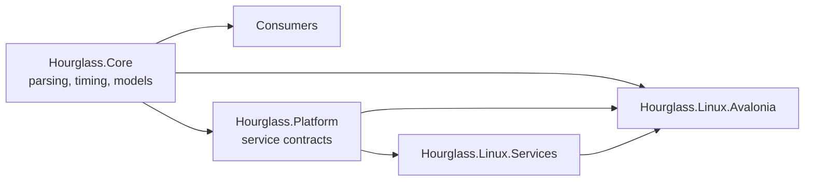
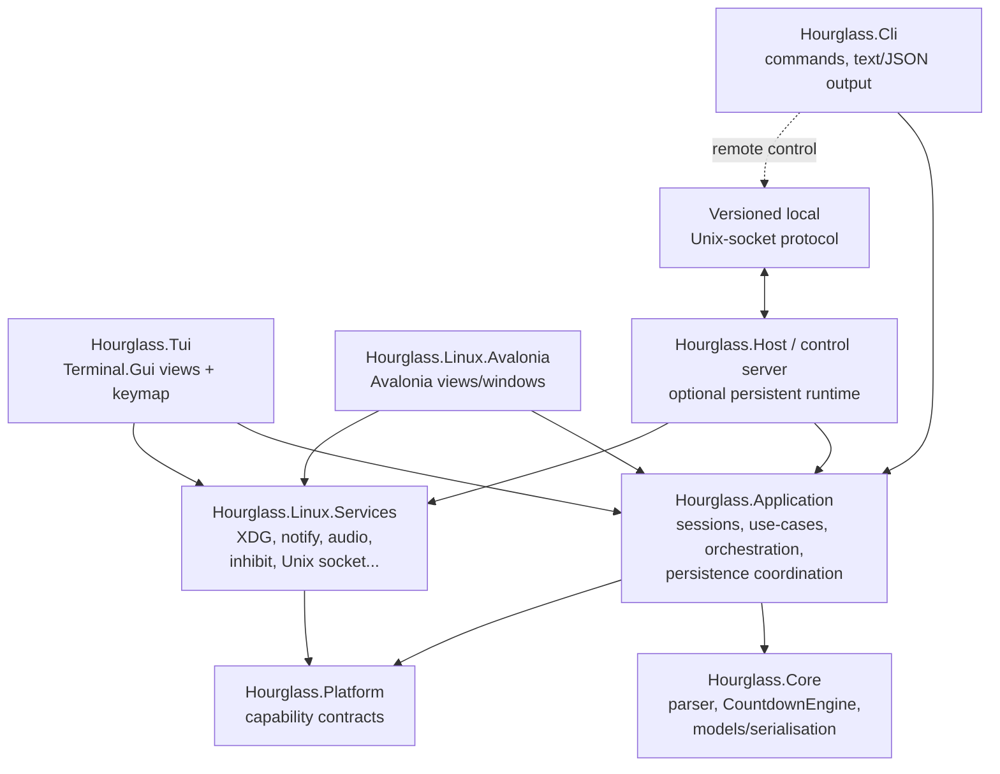
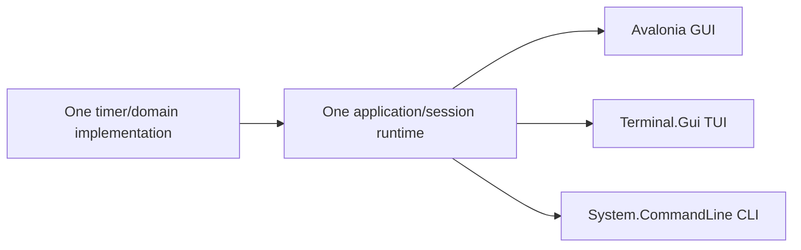

# Hourglass Linux CLI and TUI Port — Deep Research Report

## Executive summary

**Recommendation:** keep the CLI and TUI in **C#/.NET 10**, add a new UI-neutral application/orchestration layer, use **System.CommandLine 2.x** for the scriptable CLI, and use **Terminal.Gui v2** for the full-screen TUI. Do **not** rewrite the timer engine, parser, persistence contracts, or Linux integration layer in Python, Rust, or Go unless there is a strategic reason beyond this port. Hourglass already has exactly the abstractions a terminal frontend needs: platform-neutral parsing and countdown logic in `Hourglass.Core`, capability interfaces in `Hourglass.Platform`, and Linux implementations in `Hourglass.Linux.Services`. fileciteturn5file0L2-L2

The principal architectural problem is not terminal rendering. It is that a substantial amount of reusable **application behaviour is still located inside the Avalonia assembly**. `TimerWindowCoordinator` combines persistence, session restoration, multi-timer management, platform-service coordination and window lifecycle, while `MainWindowViewModel` contains much of the timer command/state/settings logic. Those should be split so Avalonia, CLI and TUI become thin adapters over the same application services. fileciteturn19file0L2-L2 fileciteturn20file0L2-L2

A further important finding is that I found **no browser frontend in the inspected `hourglass-linux` source tree**. The repository describes the current Linux frontend as native Avalonia and documents feature parity against the original Windows implementation. I therefore treat the current documented Avalonia behaviour as the authoritative parity specification for this report. A separate browser implementation outside this repository could change some presentation details, but not the recommended architectural direction. fileciteturn4file0L2-L2 fileciteturn5file0L2-L2

The recommended end state is:

```text
hourglass              Scriptable CLI
hourglass-tui          Full-screen interactive TUI
hourglass-linux        Existing Avalonia GUI
          \               |               /
           \              |              /
               Hourglass.Application
                 /                \
        Hourglass.Core       Hourglass.Platform
                                   |
                          Hourglass.Linux.Services
```

The highest-value first change is therefore to create `Hourglass.Application`, rather than starting with a terminal toolkit.

For the CLI, Microsoft's current `System.CommandLine` documentation targets .NET 10 and provides typed arguments/options, subcommands, help generation, validation and command actions; the current tutorial pins `System.CommandLine` 2.0.0. citeturn11search3turn11search17 For the TUI, Terminal.Gui v2 is a .NET-native, MIT-licensed toolkit with full-screen and inline operation, layout, focus/navigation, widgets, configurable key bindings, Unicode and Linux support. citeturn12search4turn11search12 It is the best interoperability fit, though it should be **version-pinned after a short spike**: v2 has seen active API movement in 2026, and an open issue reports performance regressions in some v2 scenarios. Terminal.Gui 2.5.0 was released on 11 September 2026. citeturn12search6turn12search7 Hourglass itself has no demanding terminal-performance requirement, so this is a manageable rather than disqualifying risk.

A Python/Textual implementation would arguably offer the strongest pure-TUI developer experience: Textual is active, MIT-licensed, asynchronous, has sophisticated widgets, excellent headless interaction testing, and can render the same application in a terminal or browser. citeturn13search0turn11search16 But it would introduce a second runtime and force Hourglass either to duplicate domain logic or establish an IPC boundary back to .NET. Rust/Ratatui and Go/tview make excellent independent TUI applications but have the same interoperability problem. Ratatui is the maintained successor to `tui-rs`, currently 0.30.2 with Crossterm 0.29 as its default backend; tview provides a mature set of Go widgets on tcell. citeturn15search5turn11search4turn12search0

### Recommended scope

The CLI/TUI should target **behavioural parity, not visual parity**. Timer semantics, saved timers, multiple concurrent timers, restoration, notifications, sounds and advanced timer behaviours should be shared. Window-manager concepts such as window geometry, always-on-top, taskbar progress and tray icons should not be emulated artificially in a terminal.

A practical development budget is approximately:

| Delivery level | Experienced developer | Small team of 2–3 | Expected result |
|---|---:|---:|---|
| Technical spike | 24–40 person-hours | 28–48 person-hours | Architecture validated, CLI and TUI prototype |
| Useful MVP | 240–340 person-hours | 275–390 person-hours | CLI + TUI, core timer operations, persistence, saved timers, basic platform integration |
| Production-ready full terminal product | **500–770 person-hours** | **570–880 person-hours** | Shared application layer, IPC/headless host, strong parity, terminal/accessibility testing, packages/docs |
| Calendar duration | roughly 14–22 productive weeks for one developer | roughly 7–12 weeks | Team work is not linearly parallelisable |

The main risks are **application-layer extraction, persistent process/IPC semantics, terminal input compatibility, accessibility and packaging**, not countdown correctness. The repo already has a monotonic countdown engine and extensive platform-neutral extraction. fileciteturn5file0L2-L2

## Repository assessment and parity baseline

### Current technology and architecture

The modern Linux solution is already strongly positioned for multiple frontends.

| Attribute | Current state | Implication for CLI/TUI |
|---|---|---|
| Primary implementation language | C#/.NET | Strong reason to remain on .NET |
| UI language/technology | Avalonia/XAML | Should remain isolated to GUI project |
| Target framework | `net10.0` | New projects should initially target the same framework |
| SDK | `.NET 10.0.108` pinned in `global.json` with feature roll-forward | Reuse existing toolchain |
| Build system | SDK-style `.csproj`, MSBuild through `dotnet`; `Hourglass.Linux.sln` | Add new projects to existing solution |
| Current GUI packages | Avalonia 12.0.4, Desktop, Fluent, X11 | CLI/TUI projects should **not** reference Avalonia |
| Test framework | xUnit 2.9.3 + Microsoft.NET.Test.Sdk | Extend current test infrastructure |
| Licence | MIT | Compatible with proposed MIT terminal dependencies |
| Linux runtime | Currently `linux-x64` | Expand terminal artefacts to arm64; consider musl separately |
| Configuration | XDG configuration directory, normally `$XDG_CONFIG_HOME/hourglass-linux` or `~/.config/hourglass-linux` | All frontends should read/write the same documents |
| Packaging today | self-contained publish, AppDir/AppImage prototype, draft Flatpak metadata | Keep GUI packaging; add terminal-oriented binaries/native packages |
| CI | restore, Release build with warnings as errors, tests, `dotnet format`, packaging validation | Straightforward to extend |

These facts are directly reflected in the solution, project, SDK, CI and packaging files. fileciteturn7file0L2-L2 fileciteturn16file0L2-L2 fileciteturn17file0L2-L2 fileciteturn18file0L2-L2 fileciteturn12file0L2-L2

The repo's intended dependency structure is already:



The architecture documentation explicitly says `Hourglass.Core` must not depend on UI or platform implementation details; `Hourglass.Platform` provides boundaries; `Hourglass.Linux.Services` supplies Linux implementations; and Avalonia composes those pieces. An architecture test already guards that direction. fileciteturn5file0L2-L2

That is exactly the right foundation for a multi-frontend product. The problem is that the logical *application layer* is implicit rather than a separate assembly.

### Reusable assets that should not be ported again

The project has already extracted the expensive domain parts from the old WPF application: parser/token logic, parser resources and extensions, timer-start models and serialisation types, window-title data and a monotonic `CountdownEngine`. The source inventory specifically recommends keeping state and domain behaviour reusable while keeping UI and platform coupling out of Core. fileciteturn13file0L2-L2

The TUI and CLI should therefore consume, not recreate:

**Timer expression grammar.** `TimerStart.FromString()` is already the canonical parser. The present Linux command-line parser already delegates validation to it, including absolute-time validation against a wall clock. fileciteturn9file0L2-L2

**Countdown truth.** `CountdownEngine` uses a monotonic clock for elapsed countdown semantics, with wall-clock time reserved for display and absolute scheduling. That is particularly valuable for a terminal app because it prevents UI refresh timing from becoming timer truth. fileciteturn5file0L2-L2

**Settings contracts.** `LinuxAppSettings` already contains notification/audio settings, always-on-top, pop-up, prompt-on-exit, reverse progress, elapsed-time display, loop timer/sound, close-on-expiry, interface lock, keep-awake, shutdown, taskbar/tray, session restoration, saved-timer startup, theme, title mode, sound ID and wake settings. Its JSON constructor defines backwards-compatible defaults. fileciteturn10file0L2-L2

**Linux capability services.** The platform assembly already has interfaces for notifications, audio, settings, status icons, session inhibition, desktop progress, single-instance behaviour, wake alarms, startup integration, system power and diagnostics. fileciteturn8file0L2-L2

**Persistence location.** `XdgSettingsPathService` already honours `XDG_CONFIG_HOME` and falls back to `~/.config/hourglass-linux`; terminal frontends should use this same implementation and data set rather than create `~/.config/hourglass-tui`. fileciteturn15file0L2-L2

### Where the existing architecture is still GUI-coupled

`TimerWindowCoordinator` is the principal extraction target. It sits in `Hourglass.Linux.Avalonia` and directly uses Avalonia lifetime, window and dispatcher types, yet it also owns:

- shared settings/saved-timer/active-session document coordination;
- active-session restoration;
- multiple session IDs;
- creation and disposal of platform services;
- status-icon and desktop-progress orchestration;
- wake scheduling;
- session inhibition;
- secondary-launch handling;
- persistence on state changes. fileciteturn19file0L2-L2

Likewise, `MainWindowViewModel` contains a great deal of frontend-neutral behaviour: start, pause/resume, reset, restart, timer input, notifications, audio, inhibition, saving/opening timers, recent inputs, advanced options and active-session persistence. Although it lives in the Avalonia project, its dependencies are predominantly `Hourglass.Platform`, `Hourglass.Serialization`, `Hourglass.Settings` and `Hourglass.Timing`; it already uses an `IUiDispatcher` abstraction. fileciteturn20file0L2-L2

This makes extraction relatively low-risk: **move behaviour, do not redesign it all at once**.

### Existing CLI support is not yet a CLI application

Hourglass already understands:

```text
hourglass-linux [--title|-t TITLE] TIMER EXPRESSION
```

and zero arguments are interpreted as an activation request. The parser rejects unknown options and invalid or already-past expressions before issuing a single-instance request. fileciteturn9file0L2-L2

That is useful backwards compatibility, but it is fundamentally a **GUI launcher protocol**. `SingleInstanceLaunchRequestKind` presently exposes only `Activate` and `StartTimer`; it cannot express list, status, pause, resume, restart, stop, dismiss, settings queries or saved-timer management. fileciteturn8file0L2-L2

A complete CLI therefore needs a proper command model and, eventually, a request/response control protocol.

## Technology stack decision

### Candidate framework comparison

| Candidate | TUI capability and maturity | Licence | Linux/runtime story | Existing-code interoperability | Principal advantages | Principal disadvantages | Fit |
|---|---|---|---|---|---|---|---|
| **C# / Terminal.Gui v2 + System.CommandLine** | Terminal.Gui v2 is released, cross-platform, keyboard-first, full-screen/inline and widget-rich; System.CommandLine 2.x is Microsoft's current typed CLI library. citeturn12search4turn11search3 | Terminal.Gui MIT; Hourglass MIT. citeturn12search4 | Same .NET 10 runtime; terminal project can avoid Avalonia/X11 completely | **Direct project references** to Core/Platform/Services | Maximum code reuse; single toolchain; shared models, JSON and tests; simplest debugging | Terminal.Gui v2 is comparatively young and still active; current issue history warrants pinning and a spike. citeturn12search6turn12search7 | **Best overall** |
| **Python / Textual** | Highly capable, active TUI framework with widgets, layouts, asynchronous internals, command palette, terminal and browser operation, plus first-class headless testing. citeturn13search0turn11search16 | MIT. citeturn13search1 | Python runtime/pip/pipx; broadly portable | No natural in-process .NET binding; use JSON/Unix socket or duplicate logic | Excellent TUI ergonomics/testing; very rapid UI development; can also expose same UI via browser | Second language/runtime; `Ctrl+P` default command palette collides with Hourglass's existing pause binding; application semantics would cross IPC | Strong TUI, poor repo fit |
| **Python / Urwid** | Long-established console UI toolkit; Python 3.9+, multiple event loops, widgets, UTF-8 and true-colour support. citeturn14search0 | Additional licence review required before selection | pip or distro package | IPC/FFI boundary needed | Mature, lean, flexible, known Unix pedigree | More manual UI composition than Textual; weak strategic reason to add Python here | Viable, not recommended |
| **Rust / Ratatui + Crossterm** | Active maintained successor to `tui-rs`; Ratatui 0.30.2 currently defaults to Crossterm 0.29. citeturn15search5turn11search1 | MIT. citeturn15search5 | Excellent native binary story; Rust 1.88+ for current Ratatui. citeturn11search4 | IPC is preferable; FFI would be high-complexity | Excellent terminal control, strong ecosystem, small standalone native deployment possible | Rebuilds application layer in Rust or creates permanent cross-language protocol; more manual event/state architecture | Excellent greenfield choice, weak port choice |
| **Go / tview + tcell** | Broad widget set: forms, text, tables, trees, lists, grid/flex layouts, modals; active established project. citeturn12search0 | MIT. citeturn12search0 | Straightforward standalone Go binaries | IPC/reimplementation | Very fast implementation; convenient static-style deployment; rich widgets | Duplicated domain semantics or IPC; adds Go ecosystem solely for UI | Good technically, unnecessary architecturally |
| **C# / Spectre.Console.Cli** | Very good command-oriented CLI; not a retained full-screen application framework | Same .NET process | Same runtime | Direct | Attractive rich command output, tables and prompts | Does not substitute for a complete TUI; would become an additional dependency beside a TUI toolkit | Optional CLI presentation layer |

### Why the C# option wins

The deciding factor is **not** that Terminal.Gui is intrinsically better than Textual or Ratatui. Textual in particular is arguably more polished for modern TUI application development and provides an unusually strong automated UI-testing model. citeturn11search16turn13search0 The deciding factor is Hourglass's repository architecture.

A Python/Rust/Go TUI has only three realistic ways to use the existing C# behaviour:

1. **Reimplement it.** This creates two parsers, two timer/session implementations, two settings models and a long-term parity problem.
2. **FFI/embed .NET.** That is particularly unattractive because Hourglass's reusable surface includes asynchronous services, records, events, cancellation tokens and serialised application models rather than a small stable C ABI.
3. **IPC.** This can work well and is in fact recommended for CLI control of a long-running Hourglass host, but making IPC mandatory even for the local interactive TUI introduces avoidable operational complexity.

In C#, `Hourglass.Tui` can simply reference `Hourglass.Application`, `Hourglass.Platform` and `Hourglass.Linux.Services`.

### Recommended package choices

For the first implementation:

```xml
<!-- src/Hourglass.Cli/Hourglass.Cli.csproj -->
<ItemGroup>
  <PackageReference Include="System.CommandLine" Version="2.0.0" />
</ItemGroup>
```

Microsoft's current .NET 10 tutorial uses System.CommandLine 2.0.0 and demonstrates typed options, arguments, subcommands and actions. citeturn11search3 Pin the package rather than using prerelease floating ranges.

For the TUI:

```xml
<!-- src/Hourglass.Tui/Hourglass.Tui.csproj -->
<ItemGroup>
  <PackageReference Include="Terminal.Gui" Version="2.5.0" />
</ItemGroup>
```

Terminal.Gui's current v2 example uses an instance-based `Application.Create()` lifecycle and provides `Window`, layout primitives and views directly in C#. citeturn12search4 Because Terminal.Gui v2 has changed actively during 2026, I would put this behind a **4–8 hour technical spike** before committing the project to a version, and keep framework-specific code restricted to `Hourglass.Tui`.

Do not add Spectre.Console initially. Plain ANSI-aware text plus `System.CommandLine` is enough for a reliable scripting interface. Spectre can be added later for tables/progress when output is attached to a TTY; the important CLI contract is stable stdout/stderr/JSON, not decorative output.

## Architecture and feature mapping

### Recommended target architecture

Add an explicit application layer between presentation and existing domain/platform infrastructure:



This preserves the repo's documented dependency rule that Core is independent of presentation/platform implementation. fileciteturn5file0L2-L2

I would give `Hourglass.Application` responsibility for:

| Responsibility | New suggested type |
|---|---|
| One logical timer | `TimerSession` / `TimerSessionController` |
| Read-only observable session state | `TimerSessionSnapshot` |
| Set of active timers | `TimerSessionManager` |
| Start/pause/resume/stop/restart/dismiss use-cases | `TimerCommandService` |
| Saved timer operations | `SavedTimerService` |
| Recent-input operations | `RecentInputService` |
| App preference operations | `SettingsService` |
| Session persistence/recovery | `ActiveSessionRepository` |
| Shared app settings coordination | `AppSettingsRepository` |
| Expiry effects | `TimerExpiryCoordinator` |
| Platform effect selection | application services over `INotificationService`, `IAudioAlertService`, etc. |
| Request model for frontends and IPC | `HourglassRequest` / specific command records |

Avalonia then becomes responsible for window creation, geometry, focus/activation, graphical animation, taskbar/dock status and tray integration only.

### Proposed dependency rules

The architecture test should evolve to enforce:

```text
Hourglass.Core
    └─ depends on nothing presentation-specific

Hourglass.Platform
    └─ may depend on Core models

Hourglass.Application
    ├─ depends on Core
    └─ depends on Platform abstractions

Hourglass.Linux.Services
    ├─ depends on Core where required
    └─ depends on Platform
    └─ MUST NOT depend on Application presentation types

Hourglass.Cli
Hourglass.Tui
Hourglass.Linux.Avalonia
    ├─ depend on Application
    └─ compose Linux.Services
```

The existing architecture documentation and tests already establish a precedent for enforcing dependency direction automatically. fileciteturn5file0L2-L2

### Feature mapping

The documented Avalonia implementation is already surprisingly feature-rich: timer restart, full screen, completion feedback, reverse progress, elapsed display, looping, locking, multiple windows, window-title modes, active-session recovery, notifications, audio, keep-awake, saved timers, recent inputs, custom themes and keyboard shortcuts. fileciteturn6file0L2-L2

The terminal product should map these as follows.

| Existing feature | CLI | TUI | Recommendation |
|---|---|---|---|
| Natural-language/duration/absolute timer parsing | **Replicate** | **Replicate** | Use `TimerStart` directly; one canonical grammar |
| Start timer | **Replicate** | **Replicate** | Backwards-compatible `hourglass 5m` alias plus explicit `start` |
| Timer title | **Replicate** | **Replicate** | Preserve `-t/--title` |
| Pause/resume | **Replicate** | **Replicate** | Session-addressable in CLI |
| Stop/reset | **Replicate** | **Replicate** | Define exact CLI distinction between stop and dismiss |
| Restart duration timer | **Replicate** | **Replicate** | Keep current rule: unavailable for absolute-time expressions |
| Remaining time | status/list output | **Replicate prominently** | Same formatting model |
| Elapsed-time display | status field | **Replicate** | Respect saved/app option |
| Remaining/reverse progress | numeric field | **Replicate as bar** | CLI emits percent in JSON/plain status; no animated CLI |
| Loop timer | **Replicate** | **Replicate** | Application-layer policy, not frontend code |
| Loop sound | **Replicate** | **Replicate** | Use current audio service |
| Close when expired | **Adapt** | **Adapt** | Meaning becomes end/remove session; do not terminate unrelated timers |
| Lock interface | **Adapt** | **Replicate** | TUI disables mutating actions; CLI should reject mutation with a clear error unless a future explicit override is designed |
| Notifications | **Replicate** | **Replicate** | Best-effort Linux service |
| Audio alerts | **Replicate** | **Replicate** | Same IDs and availability checks |
| Keep computer awake | **Replicate** | **Replicate** | Use `ISessionInhibitor` |
| Wake from suspend | **Defer** | **Defer** | Already disabled-by-default/advanced in GUI |
| Shut down on expiry | **Omit until backend exists** | **Omit until backend exists** | Current Linux service deliberately reports unsupported |
| Recent inputs | list/clear/use | **Replicate** | Same persistent document |
| Saved timers | full command family | **Replicate** | TUI browser/list + CLI CRUD/run |
| Open all saved timers | start several sessions | **Replicate** | Multiple windows become multiple sessions |
| Active-session restoration | **Replicate for host** | **Replicate** | Must be application-level |
| Multiple timer windows | multiple IDs | **Adapt to session list/tabs/panes** | Never fake windows in terminal |
| Prompt on exit | only in interactive `--wait` mode | **Replicate** | Non-interactive CLI must never unexpectedly prompt |
| Themes | `--color=auto/always/never` only | **Adapt** | Map semantic theme roles to terminal colours |
| Custom themes | generally omit | **Optional later** | Reuse colour values where terminal gamut permits |
| Full-screen mode | N/A | inherent | A TUI already owns an alternate/full terminal screen |
| Always on top | **Omit** | **Omit** | Window-manager concept |
| Pop up on expiry | **Omit/adapt to notification** | highlight + notification | Terminal cannot request equivalent window focus reliably |
| Taskbar/dock progress | **Omit** | **Omit** | GUI desktop-shell integration |
| Notification-area icon | **Omit** | **Omit** | Not part of terminal UX |
| Window geometry restoration | **Omit** | **Omit** | Replace with responsive layout |
| Window-title modes | **Omit by default** | optional later | OSC terminal-title mutation is terminal-specific and unnecessary |
| Completion flash/error animation | one-shot error text | restrained visual state | Avoid animation dependence |
| About/version diagnostics | `--version`, `about`, `doctor` | Help/About screen | Replicate useful metadata |
| Keyboard operations | command names/options | **Replicate semantics** | Adapt bindings to terminal realities |

The original GUI keyboard contract is Enter to start, Space or `Ctrl+P` to pause/resume, `Ctrl+S` stop, `Ctrl+R` restart, Escape for layered cancellation/dismissal/full-screen exit and `Alt+Enter` for full-screen. fileciteturn6file0L2-L2

In the TUI, preserve those where they make sense, but add terminal-safe alternatives. In particular, **`Ctrl+S` should not be the only stop binding** because some terminal/TTY configurations reserve `Ctrl+S`/`Ctrl+Q` for software flow control. A simple `s` or `x` binding should also stop a timer. `Alt+Enter` is unnecessary because the TUI is already full-screen.

A sensible default TUI key map is:

| Action | Recommended key |
|---|---|
| Start/edit confirmation | `Enter` |
| Pause/resume | `Space`, `Ctrl+P` |
| Stop | `s` plus `Ctrl+S` where delivered |
| Restart | `r`, `Ctrl+R` |
| Edit timer | `e` |
| New timer | `n` |
| Next/previous session | `Tab` / `Shift+Tab` or `[` / `]` |
| Saved timers | `v` |
| Settings | `,` |
| Help/key map | `?` / `F1` |
| Back/dismiss | `Esc` |
| Quit | `q`, with prompt if timers require it |

### CLI command surface

The CLI should be a stable automation API, not merely a textual copy of buttons.

Recommended surface:

```text
hourglass start "25m" --title "Focus"
hourglass start "14:30" --detach
hourglass list
hourglass status <session-id>
hourglass pause <session-id|all>
hourglass resume <session-id|all>
hourglass stop <session-id|all>
hourglass restart <session-id>
hourglass dismiss <session-id>

hourglass saved list
hourglass saved add "25m" --title "Pomodoro"
hourglass saved run <name-or-id>
hourglass saved remove <id>
hourglass saved clear

hourglass recent list
hourglass recent clear

hourglass config list
hourglass config get notifications-enabled
hourglass config set notifications-enabled true

hourglass tui
hourglass gui

hourglass doctor
hourglass about
hourglass --version
```

Every information-returning command should support:

```text
--json
--plain
```

`--json` turns the CLI into a stable machine interface. `--plain` should prohibit terminal escape sequences and interactive formatting. Human-readable output belongs on stdout; diagnostics/errors belong on stderr; command failures use predictable non-zero exit codes.

Preserve the existing shorthand:

```text
hourglass 5m
hourglass --title "Tea" 5m
hourglass -t "Tea" 5m
```

as aliases for `hourglass start`, so existing launcher-style usage does not regress. The present parser already documents this input shape. fileciteturn9file0L2-L2

### Persistent timers and the headless-host question

This is the most important semantic design decision.

A normal CLI command exits. A timer that must continue for 45 minutes, notify at expiry, restore after a frontend closes, and remain controllable from another shell needs a process to own it.

There are three modes worth supporting:

**Foreground CLI:**

```text
hourglass start 25m --wait
```

The CLI process owns the timer until completion or interruption. This is easy and should be the first implementation.

**Existing-host control:**

```text
hourglass start 25m --detach
```

If an Avalonia GUI or TUI process already owns the shared runtime/control socket, the CLI asks it to create a session and returns.

**Headless runtime:**

When no GUI/TUI is running, detached timers need a small host process. This can be a separate `Hourglass.Host` executable or an internal `hourglass host` mode. I favour a dedicated `Hourglass.Host` project but a package-private executable, so normal users still think in terms of `hourglass`.

Do not initially build a system-wide daemon. This should be a **per-user, on-demand process** sharing the existing XDG persistence and platform services.

The existing single-instance Unix-socket mechanism is a natural starting point: the repo already hands secondary launches to a running process using a per-user socket. fileciteturn6file0L2-L2 The present request type is one-way and too limited, so add a new request/response protocol instead of stretching `SingleInstanceLaunchRequest` indefinitely.

For example:

```json
{
  "protocolVersion": 1,
  "requestId": "b822987d3d76431db7ef14921a118811",
  "command": "pause",
  "sessionId": "29f0d89924e94608af7701899be6ea71"
}
```

Response:

```json
{
  "protocolVersion": 1,
  "requestId": "b822987d3d76431db7ef14921a118811",
  "ok": true,
  "exitCode": 0,
  "session": {
    "id": "29f0d89924e94608af7701899be6ea71",
    "state": "paused",
    "title": "Focus",
    "remainingMilliseconds": 812533
  }
}
```

Give the protocol explicit versioning, bounded message sizes, request IDs, stable session IDs, local-user-only socket permissions and deterministic error codes. That also makes a future Rust/Python/Go client possible without making a second language part of the core application.

## Implementation plan, code structure and prototypes

### Proposed repository structure

The existing source tree should evolve from four main modern projects to these:

```text
src/
├── Hourglass.Core/
│   ├── Parsing/
│   ├── Serialization/
│   ├── Settings/
│   └── Timing/
│
├── Hourglass.Platform/
│   └── PlatformServices.cs
│
├── Hourglass.Application/                 # NEW
│   ├── Commands/
│   │   ├── TimerAction.cs
│   │   ├── StartTimerRequest.cs
│   │   └── TimerCommandResult.cs
│   ├── Sessions/
│   │   ├── TimerSession.cs
│   │   ├── TimerSessionSnapshot.cs
│   │   ├── TimerSessionManager.cs
│   │   └── TimerSessionEvents.cs
│   ├── Persistence/
│   │   ├── AppSettingsRepository.cs
│   │   ├── ActiveSessionRepository.cs
│   │   └── SavedTimerRepository.cs
│   ├── Services/
│   │   ├── SavedTimerService.cs
│   │   ├── RecentInputService.cs
│   │   ├── TimerExpiryCoordinator.cs
│   │   └── HourglassRuntime.cs
│   └── Hourglass.Application.csproj
│
├── Hourglass.Linux.Services/
│   ├── ...existing services...
│   └── Control/
│       ├── UnixControlServer.cs           # NEW
│       └── UnixControlClient.cs           # NEW
│
├── Hourglass.Cli/                         # NEW
│   ├── Commands/
│   │   ├── StartCommand.cs
│   │   ├── ListCommand.cs
│   │   ├── ControlCommands.cs
│   │   ├── SavedCommands.cs
│   │   ├── ConfigCommands.cs
│   │   └── DoctorCommand.cs
│   ├── Output/
│   │   ├── HumanOutputWriter.cs
│   │   ├── PlainOutputWriter.cs
│   │   └── JsonOutputWriter.cs
│   ├── Program.cs
│   └── Hourglass.Cli.csproj
│
├── Hourglass.Tui/                         # NEW
│   ├── App/
│   │   └── HourglassTuiApplication.cs
│   ├── Views/
│   │   ├── TimerDashboard.cs
│   │   ├── SessionListView.cs
│   │   ├── TimerEditorDialog.cs
│   │   ├── SavedTimersDialog.cs
│   │   ├── SettingsDialog.cs
│   │   └── HelpDialog.cs
│   ├── Input/
│   │   └── HourglassKeyMap.cs
│   ├── Presentation/
│   │   ├── TerminalTheme.cs
│   │   └── TimerTextFormatter.cs
│   ├── Program.cs
│   └── Hourglass.Tui.csproj
│
├── Hourglass.Host/                        # NEW, later milestone
│   ├── Program.cs
│   └── Hourglass.Host.csproj
│
└── Hourglass.Linux.Avalonia/
    ├── ...views...
    ├── TimerWindowCoordinator.cs          # SHRINK substantially
    └── MainWindowViewModel.cs             # SHRINK to UI adapter
```

Tests:

```text
tests/
├── Hourglass.Core.Tests/
├── Hourglass.Application.Tests/           # NEW
├── Hourglass.Linux.Services.Tests/
├── Hourglass.Cli.Tests/                   # NEW
├── Hourglass.Tui.Tests/                   # NEW
├── Hourglass.ControlProtocol.Tests/       # optional split
└── Hourglass.Linux.Avalonia.Tests/
```

The existing modern solution already separates Core, Platform, Linux services, Avalonia and their tests, so this is an extension of the repo's current architectural direction rather than a reorganisation from scratch. fileciteturn16file0L2-L2

### Extraction sequence

The safest sequence is **strangler-style extraction**: each change leaves the current GUI operational.

**First, create `Hourglass.Application` with no behaviour change.** Move frontend-neutral records/services from Avalonia one at a time. Add project-reference checks before adding the CLI/TUI.

**Next, extract one timer session from `MainWindowViewModel`.** The goal is for Avalonia's view model to observe and invoke a `TimerSession`, rather than own countdown and side-effect behaviour itself.

A target shape could be:

```csharp
public interface ITimerSession
{
    string Id { get; }
    TimerSessionSnapshot Snapshot { get; }

    event EventHandler<TimerSessionSnapshot>? Changed;

    Task<CommandResult> StartAsync(
        StartTimerRequest request,
        CancellationToken cancellationToken = default);

    Task<CommandResult> PauseAsync(CancellationToken cancellationToken = default);
    Task<CommandResult> ResumeAsync(CancellationToken cancellationToken = default);
    Task<CommandResult> StopAsync(CancellationToken cancellationToken = default);
    Task<CommandResult> RestartAsync(CancellationToken cancellationToken = default);
    Task<CommandResult> DismissAsync(CancellationToken cancellationToken = default);
}
```

The immutable snapshot might contain:

```csharp
public sealed record TimerSessionSnapshot(
    string Id,
    TimerState State,
    string Input,
    string? Title,
    TimeSpan TimeRemaining,
    TimeSpan TimeElapsed,
    double Progress,
    bool IsRepeatable,
    bool IsLocked,
    bool IsExpired,
    DateTimeOffset? TargetTime);
```

The important point is that **neither type knows anything about Avalonia or Terminal.Gui**.

**Then extract `TimerWindowCoordinator`'s non-window work.** Create `TimerSessionManager` for session ownership and a shared runtime/persistence coordinator. The Avalonia coordinator becomes roughly:

```text
Runtime says session added
    -> create MainWindow
Runtime says session removed
    -> close MainWindow

Window activated
    -> mark session as most recently presented

Window closed
    -> request runtime remove/close
```

Everything involving `active-sessions`, saved timers, session IDs, wake scheduling and global settings should move below that adapter boundary.

**Finally, add CLI and TUI.** At that point the frontends become relatively shallow.

### Minimal CLI prototype

The exact public APIs of command-line libraries should be pinned by package version, but this is the intended application shape:

```csharp
using System.CommandLine;
using Hourglass.Application;

var expressionArgument =
    new Argument<string>("expression")
    {
        Description = "Timer expression, for example '25m' or '14:30'."
    };

var titleOption =
    new Option<string?>("--title", "-t")
    {
        Description = "Optional timer title."
    };

var detachOption =
    new Option<bool>("--detach")
    {
        Description = "Leave the timer running after this command exits."
    };

var startCommand = new Command("start", "Start a timer")
{
    expressionArgument,
    titleOption,
    detachOption
};

startCommand.SetAction(async parseResult =>
{
    string expression = parseResult.GetValue(expressionArgument)!;
    string? title = parseResult.GetValue(titleOption);
    bool detach = parseResult.GetValue(detachOption);

    // Resolve through the composition root rather than new'ing the engine here.
    IHourglassClient client = HourglassComposition.CreateClient();

    StartTimerResult result = await client.StartAsync(
        new StartTimerRequest(expression, title, detach),
        CancellationToken.None);

    Console.WriteLine($"{result.SessionId}\t{result.State}");
});

var root = new RootCommand("Hourglass timer");
root.Subcommands.Add(startCommand);

return root.Parse(args).Invoke();
```

Microsoft's current System.CommandLine documentation establishes the `RootCommand`/subcommand/options/arguments/action model under .NET 10. citeturn11search3turn11search17 The production version should keep command construction separate from `Program.cs` so commands can be invoked directly in tests without launching a subprocess for every parser test.

### Minimal TUI prototype

Terminal.Gui's current v2 model is instance-based. Its own example starts from `Application.Create()`, initialises it, creates a `Window` and runs the application. citeturn12search4 A first Hourglass spike could deliberately contain almost no business logic:

```csharp
using Terminal.Gui.App;
using Terminal.Gui.ViewBase;
using Terminal.Gui.Views;

using IApplication app = Application.Create();
app.Init();

using Window window = new()
{
    Title = "Hourglass"
};

var time = new Label
{
    Text = "25:00",
    X = Pos.Center(),
    Y = 2
};

var status = new Label
{
    Text = "Ready",
    X = Pos.Center(),
    Y = 4
};

window.Add(time, status);

// Production code binds the key map to IHourglassRuntime / ITimerSession.
// No parser, countdown maths, persistence or Linux integration belongs here.

app.Run(window);
```

The technical spike should prove four things before building further: reliable 4–10 Hz countdown repainting, resize behaviour, key events including Escape/Space/Ctrl combinations, and clean terminal restoration on normal exit and exceptions. Terminal.Gui v2 explicitly supports responsive layout, keyboard-oriented UI, full-screen operation and a configurable navigation/input model. citeturn12search4turn11search12

### Recommended TUI layout

At an ordinary 80×24 terminal:

```text
┌ Hourglass ────────────────────────────────────────────────────────┐
│ Timers: 3                               [Running] Focus           │
├──────────────────┬───────────────────────────────────────────────┤
│ > Focus          │                                               │
│   Tea            │                    18:42                      │
│   Laundry        │                                               │
│                  │           █████████████░░░░░░  75%            │
│                  │                                               │
│                  │              Running                          │
│                  │                                               │
├──────────────────┴───────────────────────────────────────────────┤
│ Space Pause   s Stop   r Restart   e Edit   n New   ? Help      │
└──────────────────────────────────────────────────────────────────┘
```

For narrow terminals, the layout should collapse to the active timer only; the session list becomes a modal/selector. Do not require a particular terminal emulator, font or minimum colour depth for functional use.

### Control-protocol integration

Do not overload `ISingleInstanceService` with dozens of new methods. Retain it as a compatibility abstraction for application instance acquisition, and add:

```csharp
public interface IControlServer : IAsyncDisposable
{
    Task StartAsync(
        Func<ControlRequest, CancellationToken, Task<ControlResponse>> handler,
        CancellationToken cancellationToken = default);
}

public interface IControlClient
{
    Task<ControlResponse> SendAsync(
        ControlRequest request,
        CancellationToken cancellationToken = default);
}
```

Place the contracts in `Hourglass.Platform` or `Hourglass.Application` depending on whether you treat local control transport as platform-specific or application infrastructure; place the Unix-socket implementation in `Hourglass.Linux.Services`.

The repo already has Unix-socket secondary-launch handoff and per-user single-instance semantics, so this extends a known platform technique rather than introducing a different IPC technology. fileciteturn6file0L2-L2

### Persistence and configuration compatibility

Keep the existing files and schemas. Do not introduce separate `tui.json` and `cli.json` copies of timer preferences.

The repo's current settings directory is already XDG-aware. fileciteturn15file0L2-L2 Existing documented persistence includes recent timer expressions, saved timer definitions, active-session restoration, preferences, custom themes and geometry. fileciteturn6file0L2-L2

The right separation is:

```text
Shared, all frontends
    app.json
    saved-timers.json / existing keyed equivalent
    active-sessions.json / keyed equivalent
    custom-themes.json

Frontend-specific, only where truly necessary
    tui.json
        - optional key-map overrides
        - optional TUI layout preference
        - terminal colour mode preference

    Avalonia-specific state
        - window geometry
```

Existing GUI-only fields can remain in `LinuxAppSettings` for backwards compatibility initially. Longer-term, consider splitting cross-frontend preferences from desktop-shell preferences, but do that as a schema migration after the application extraction—not while building the first TUI.

## Testing, accessibility, CI and distribution

### Testing strategy

The existing repository already runs xUnit tests, Release builds with warnings treated as errors, formatting verification and packaging validation on GitHub Actions. fileciteturn12file0L2-L2 That should remain the base rather than introducing a separate testing system.

The test pyramid should be:

| Layer | Tests to add | Importance |
|---|---|---|
| Core | Existing parser/countdown tests retained; regression cases for all CLI-accepted timer expressions | Critical |
| Application | Timer state transitions with fake monotonic clock; restart/loop/lock rules; expiry side effects; session manager | **Highest new priority** |
| Persistence | round-trip documents; missing fields/defaults; old schema fixtures; corrupted documents; session recovery | Critical |
| Platform services | existing Linux tests plus control-socket transport and lifecycle | Critical |
| CLI | parser/command tests, exit codes, stdout/stderr, JSON schema and backwards-compatible shorthand | Critical |
| TUI presentation | state-to-text/progress/key-action mapping with no terminal required | High |
| TUI integration | pseudo-terminal startup, resize, key dispatch, clean shutdown | High |
| Packaging | installed binaries, config sharing, asset inclusion, notification/audio availability probes | High |
| Manual terminal matrix | actual emulators, SSH/tmux, small dimensions, colour modes, keyboard-only | Release gate |

The application layer is where the overwhelming majority of behavioural tests should live. A timer should be provably correct without instantiating Terminal.Gui or Avalonia.

A useful test fixture should inject:

```csharp
FakeMonotonicClock
FakeWallClock
RecordingNotificationService
RecordingAudioAlertService
RecordingSessionInhibitor
InMemorySettingsStore
ImmediateDispatcher
```

This follows the architecture already used by the modern code: countdown uses a monotonic clock and platform behaviours are interface-bound. fileciteturn5file0L2-L2

For CLI tests, explicitly verify:

```text
hourglass 5m
hourglass -t Tea 5m
hourglass start 5m --title Tea
hourglass start nonsense
hourglass pause unknown-id
hourglass list --json
hourglass config set unknown-key true
```

Assertions should include exit status and streams. JSON tests should deserialize into a contract type rather than snapshot whitespace.

For the control socket, cover malformed JSON, unsupported protocol versions, stale socket files, server disappearance, simultaneous commands, requests for unknown sessions, cancellation, clean shutdown and a maximum accepted request size.

For the TUI, keep terminal-toolkit tests shallow and focus on the `Hourglass.Application` state. A PTY smoke job can then prove that starting, resizing and exiting does not corrupt terminal state.

Textual deserves special mention in the comparison because it would provide built-in headless `run_test()` and `Pilot` keyboard/mouse interaction tests. citeturn11search16 Terminal.Gui does not change the recommendation, but it raises the value of maintaining a frontend-independent presentation/state layer so most tests do not depend on the toolkit.

### Accessibility and terminal UX

Avalonia's present implementation exposes automation names/help text and checked states for many controls. fileciteturn6file0L2-L2 A terminal application cannot simply reproduce desktop accessibility APIs, because accessibility is partly mediated by the terminal emulator and screen reader.

The terminal design should therefore make **the CLI the canonical accessibility fallback** and make the TUI usable without colour or mouse interaction.

Required design principles:

| Requirement | Design response |
|---|---|
| Keyboard-only operation | Every feature reachable via keys; no mouse-only controls |
| Screen-reader-friendly alternative | Every TUI operation has a CLI equivalent |
| No colour dependency | State also appears in words/symbols; `Paused`, `Expired`, `Locked` |
| Focus visibility | Strong text/border/focus marker, not colour alone |
| Reduced visual churn | Do not animate decorative content; timer refresh need not repaint unrelated screen regions |
| Plain terminals | `--plain`, no escape sequences, no Unicode dependency |
| Machine accessibility | `--json` for structured consumers |
| Help discoverability | permanent short footer + `?`/F1 full key map |
| Small terminal sizes | collapse layout instead of clipping controls |
| Error handling | durable textual validation message, not a flashing-only state |

A useful accessibility mode could be:

```text
hourglass-tui --accessible
```

which updates the visible clock less often, disables non-essential animation, replaces graphical progress with text and uses explicit state labels. This is a product recommendation rather than something the underlying toolkit provides automatically.

Terminal.Gui is explicitly keyboard-oriented and has navigation/focus configuration facilities. citeturn12search4turn11search12 Nevertheless, test actual focus traversal and keyboard delivery rather than assuming toolkit defaults satisfy accessibility.

### Cross-distribution support

The current project publishes only `linux-x64`; the packaging documentation describes `linux-arm64` as future work. fileciteturn14file0L2-L2 A terminal build is a good opportunity to widen support because it does not need Avalonia/X11 dependencies.

Recommended release targets:

```text
Tier A
  linux-x64
  linux-arm64

Tier B, once tested
  linux-musl-x64
  linux-musl-arm64
```

Microsoft currently supports .NET 10 on Alpine 3.21–3.23 for x86_64 and aarch64, among other architectures, but Alpine uses the musl environment and should be treated as a separate publishing/testing path rather than assuming the current `linux-x64` artefact covers it. citeturn15search0turn15search7

For ordinary desktop/server distributions, a self-contained .NET build avoids requiring the correct runtime to be preinstalled. .NET's single-file deployment can bundle application dependencies and may be combined with self-contained publishing. citeturn16search1

Start with self-contained single-file or small publish-directory artefacts. **Do not start with Native AOT.** Native AOT can improve startup and memory usage and produces a self-contained native application, but it introduces trimming/AOT constraints, extra build toolchain requirements and platform-specific compilation. Microsoft explicitly documents those limitations and analyzers. citeturn16search0 There is no stated Hourglass performance constraint that justifies making it a first-release risk.

### CI changes

Extend `.github/workflows/tests.yml` approximately as follows:

```text
Existing test job
  dotnet restore
  dotnet build -warnaserror
  dotnet test
  dotnet format --verify-no-changes
        |
        +-- now includes:
            Hourglass.Application.Tests
            Hourglass.Cli.Tests
            Hourglass.Tui.Tests

New architecture check
  Core -> no UI
  Application -> no Avalonia/Terminal.Gui
  Linux.Services -> no presentation package
  CLI -> no Avalonia
  TUI -> no Avalonia

New terminal smoke job
  publish CLI/TUI
  hourglass --version
  hourglass start invalid -> expected failure
  hourglass start 1s --wait -> expected completion
  hourglass list --json -> valid JSON
  launch TUI in PTY
  send quit key
  verify clean exit

Packaging matrix
  linux-x64
  linux-arm64
  later linux-musl-x64 / linux-musl-arm64
```

The current workflow is already a strong base: it uses immutable action SHAs, .NET 10, full tests, formatting and separate packaging validation. fileciteturn12file0L2-L2

Do not claim terminal compatibility solely from an Ubuntu Actions job. Keep a lightweight manual release matrix across representative environments such as a GNOME terminal, KDE/Konsole-class terminal, an xterm-compatible terminal, one modern terminal such as Kitty/WezTerm, tmux, SSH and the Linux virtual console. This is testing strategy, not a promised support matrix.

### Packaging and distribution

The existing packaging strategy says Flatpak first and AppImage second for the **desktop GUI**, with deb, RPM, Snap and AUR currently out of scope. fileciteturn14file0L2-L2 That priority should not simply be copied to a terminal product.

| Distribution form | CLI/TUI suitability | Recommendation |
|---|---|---|
| **Self-contained tarball/binary** | Excellent | **Primary initial release** |
| **`.deb`** | Excellent on Debian/Ubuntu; natural `$PATH`, man pages, completion files | **High priority after binary release** |
| **RPM** | Excellent on Fedora/RHEL/openSUSE families | High priority alongside or after `.deb` |
| **AppImage** | Primarily GUI-oriented; executable bundle works but is awkward as a normal shell tool | Keep for GUI; do not make primary CLI channel |
| **Flatpak** | Good GUI distribution, poor fit for host-shell tooling and shared Unix-socket namespaces | Keep GUI-first; terminal support secondary |
| **Snap** | Possible, but confinement complicates shared XDG/socket/platform-service assumptions | Lower priority |
| **NuGet/.NET tool** | Useful for developers with .NET installed | Optional developer channel |
| **pip/pipx** | Only makes sense for a Python implementation | **Do not use** with recommended stack |
| **cargo/crates.io** | Only makes sense for Rust | **Do not use** with recommended stack |
| **Go module/install** | Only for Go implementation | **Do not use** with recommended stack |

The Flatpak caution is particularly concrete in this repo. Current documentation notes that sandboxing may change the settings/runtime namespace, make command-line audio tools unavailable and prevent native/AppImage and Flatpak builds from sharing a single-instance namespace. fileciteturn14file0L2-L2 Those are precisely the wrong properties for a shell-facing control tool.

For a native package, install:

```text
/usr/bin/hourglass
/usr/bin/hourglass-tui
/usr/bin/hourglass-linux

/usr/lib/hourglass/...
/usr/share/doc/hourglass/...
/usr/share/man/man1/hourglass.1.gz
/usr/share/man/man1/hourglass-tui.1.gz
```

and optionally completion files once the command grammar stabilises.

Keep all three executables in one package initially so they share an exact application-model/schema version. Splitting `hourglass-cli` and `hourglass-gui` packages is possible later, but it creates unnecessary dependency/version questions while the shared runtime is evolving.

### Licensing

The repository is MIT-licensed and requires preservation of its copyright and permission notice in substantial copies/distributions. fileciteturn11file0L2-L2 Terminal.Gui is also MIT, as are Textual, Ratatui and tview according to their upstream repositories. citeturn12search4turn13search1turn15search5turn12search0

That makes the recommended C# stack straightforward from a dependency-licensing perspective. Generated packages should still carry the project's existing MIT notice and whatever third-party notice file your release process requires.

## Effort, milestones, risks and prioritised backlog

### Detailed effort estimate

These estimates assume one experienced developer already comfortable with C#, asynchronous code and automated tests but not necessarily an expert in Terminal.Gui internals. The small-team column is **total person-hours**, not elapsed time. It is slightly higher because coordination, API design and merge/review overhead do not disappear when adding people.

| Work item | Single developer | Team of 2–3, total person-hours | Skill | Risk |
|---|---:|---:|---|---|
| Architecture ADR + Terminal.Gui/System.CommandLine spike | 16–24 h | 18–28 h | Senior .NET/TUI | Medium |
| Create `Hourglass.Application` and enforce references | 20–32 h | 24–36 h | .NET architecture | Low |
| Extract `MainWindowViewModel` timer/session logic | 44–64 h | 48–72 h | Senior C#/state machines | **High** |
| Extract coordinator/persistence/session ownership | 44–72 h | 50–82 h | Async/concurrency | **High** |
| Persistence contracts, compatibility and recovery tests | 28–44 h | 32–50 h | C#/JSON | Medium |
| CLI command model and parser | 24–36 h | 28–42 h | C# CLI | Low |
| CLI output/JSON/errors/backwards compatibility | 12–20 h | 14–22 h | API/UX | Low |
| TUI application shell and responsive layout | 32–48 h | 36–54 h | Terminal.Gui | Medium |
| TUI timer/editor/navigation/key map | 32–48 h | 36–56 h | TUI UX | Medium |
| TUI saved timers/settings/multi-session UI | 32–48 h | 36–54 h | TUI/application | Medium |
| Linux notification/audio/inhibit integration through shared runtime | 24–40 h | 28–46 h | Linux/.NET | Medium |
| Versioned control socket and client/server | 40–64 h | 46–72 h | IPC/security/async | **High** |
| Headless/detached runtime host | 40–64 h | 46–74 h | Linux process lifecycle | **High** |
| Accessibility/no-colour/small-terminal hardening | 24–40 h | 28–46 h | UX/accessibility | Medium |
| Unit/integration/PTY test expansion | 56–84 h | 64–96 h | Test engineering | Medium |
| CI and cross-runtime publish matrix | 20–28 h | 22–32 h | GitHub Actions | Low |
| Native terminal packaging | 16–24 h | 20–28 h | Linux packaging | Medium |
| User docs, man pages, migration/release checklist | 24–36 h | 28–42 h | Technical writing | Low |
| **Total** | **~528–820 h** | **~604–964 h** | — | — |

There is intentional contingency in the detailed total. With disciplined scope—especially deferring the headless host, custom TUI themes, package diversity and broad terminal matrix—the likely practical full-release range is approximately **500–770 hours for one developer**. A team will usually spend more person-hours but reach release sooner.

A first useful MVP can stop after application extraction, foreground CLI, TUI basic operations, saved timers, persistence and basic Linux effects: roughly **240–340 hours**.

### Milestone plan

| Milestone | Deliverables | Exit criterion | Indicative effort |
|---|---|---|---:|
| **Architecture spike** | ADR, Terminal.Gui prototype, System.CommandLine prototype, package versions pinned | Countdown display, resize and key handling verified; dependency plan accepted | 24–40 h |
| **Shared application runtime** | `Hourglass.Application`, session controller/manager, persistence extraction, Avalonia adapted | Existing GUI tests pass with timer behaviour no longer owned by Avalonia | 100–160 h |
| **CLI MVP** | start/status/list/pause/resume/stop/restart; `--json`; backwards syntax | Scriptable timer workflow passes integration tests | 50–80 h |
| **TUI MVP** | active timer, session selector, editor, progress, pause/stop/restart, help | Complete timer workflow without mouse | 70–110 h |
| **Parity and persistence** | saved/recent timers, settings, loops, lock, notifications/audio/inhibit, restoration | Core terminal feature map substantially complete | 80–130 h |
| **Process control** | versioned IPC, detached timers, optional headless host | Commands work from second shell with no GUI/TUI required | 80–130 h |
| **Hardening and release** | accessibility, PTY tests, distro builds, native packaging, docs | Release checklist passes | 90–140 h |

The milestones deliberately make the persistent headless host late. A useful TUI does not need a daemon, and forcing daemon design into the first prototype would delay visible value.

### Prioritised task list

| Priority | Task | Why now |
|---|---|---|
| **P0** | Record architectural decision: C# + System.CommandLine + Terminal.Gui | Prevent parallel experimentation from becoming permanent fragmentation |
| **P0** | Add `Hourglass.Application` | Every later frontend depends on this boundary |
| **P0** | Move timer state/action behaviour out of `MainWindowViewModel` | Removes the largest presentation coupling |
| **P0** | Move multi-session/persistence coordination out of `TimerWindowCoordinator` | Enables non-window frontends |
| **P0** | Add application-level state-transition tests | Protects GUI while extraction occurs |
| **P0** | Implement CLI `start`, `list/status`, pause/resume/stop/restart and `--json` | Establishes automation API early |
| **P0** | Implement TUI timer dashboard/key navigation | Demonstrates end-to-end value |
| **P1** | Saved timers, recents and settings in CLI/TUI | Major existing-user parity |
| **P1** | Notifications, sounds and inhibition through shared expiry coordinator | Avoid frontend-specific side-effect behaviour |
| **P1** | Multiple-session TUI and stable session IDs | Replaces multiple-window semantics cleanly |
| **P1** | Versioned Unix-socket control protocol | Enables cross-process CLI control |
| **P1** | Headless/detached host | Enables useful non-GUI background timers |
| **P1** | Accessibility and no-colour/plain modes | Must be designed before UX solidifies |
| **P1** | PTY and terminal-compatibility smoke tests | TUI regressions are hard to detect from unit tests alone |
| **P2** | Native `.deb`/RPM packaging | Better shell UX than Flatpak/AppImage |
| **P2** | Shell completion generation | Useful after grammar stops changing |
| **P2** | Terminal theme mapping/custom theme support | Valuable but not required for timer semantics |
| **P2** | `doctor` diagnostics | Helps troubleshoot notification/audio/socket capabilities |
| **P3** | Native AOT experiment | Only after functional compatibility is proven |
| **P3** | Wake-from-suspend terminal exposure | Existing repo already treats this as advanced/privilege-sensitive |
| **P3** | Terminal-title integration or elaborate animation | Low behavioural value |

### Key risks and mitigations

**Application extraction risk — high.** `MainWindowViewModel` and `TimerWindowCoordinator` currently combine presentation with significant behaviour. fileciteturn19file0L2-L2 fileciteturn20file0L2-L2 Mitigation: move small cohesive units behind interfaces while the GUI continues to execute the same workflows; avoid simultaneously changing semantics.

**Two sources of timer truth — critical if allowed.** A GUI timer, TUI timer and daemon timer must not independently update the same logical session. Mitigation: exactly one `TimerSession` owns each engine; frontends observe snapshots and issue commands.

**Concurrent persistence — high once multiple processes exist.** Today a single coordinator largely owns shared process state. A CLI and background host could otherwise race to update JSON. Mitigation: designate one running host as authoritative for active sessions; use IPC for mutations while it is running. Static config changes should use a coordinated/atomic store.

**Terminal.Gui v2 churn — medium.** Version 2 is now released and 2.5.0 shipped in September 2026, but upstream's recent history includes breaking changes and reported performance problems. citeturn12search6turn12search7 Mitigation: pin one tested version, confine it to `Hourglass.Tui`, and avoid allowing toolkit objects into `Hourglass.Application`.

**Terminal compatibility — medium.** Different emulators and TTY configurations handle modifiers, colour and control characters differently. Mitigation: simple key map, redundant alternatives for important commands, ASCII/plain fallback and PTY/manual testing.

**Accessibility — medium/high.** Desktop automation metadata does not transfer to terminal cell rendering. Mitigation: complete CLI parity, keyboard-first TUI, text-labelled states, low-churn accessibility mode and no information encoded only by colour.

**Sandbox/package IPC — medium/high.** The repository already notes that Flatpak can create a separate namespace from native/AppImage installs and that its audio/runtime behaviour requires validation. fileciteturn14file0L2-L2 Mitigation: treat native CLI/TUI packages as the canonical shell integration; do not require a Flatpak-hosted daemon to control a host-native CLI.

**Schema drift — medium.** Three frontends increase the consequences of incompatible settings writes. Mitigation: version persistence documents, keep unknown/default handling backwards-compatible, and add fixture tests for older documents.

### Recommended implementation order

The implementation should begin with a small architectural PR rather than a large "TUI port" branch:

```text
PR A
  Add Hourglass.Application project
  Add architecture reference tests
  No behaviour changes

PR B
  Extract TimerSession / session snapshot
  Adapt MainWindowViewModel
  Add state-transition tests

PR C
  Extract session manager + persistence coordination
  Adapt TimerWindowCoordinator

PR D
  Add Hourglass.Cli
  System.CommandLine
  start/status/list
  JSON/plain output

PR E
  Add Hourglass.Tui
  Terminal.Gui shell
  active timer + keyboard workflow

PR F
  Saved/recent/settings parity
  audio/notification/inhibition orchestration

PR G
  Versioned control protocol
  second-shell CLI control

PR H
  Headless host / detached timers

PR I
  Accessibility, PTY tests, packaging and release docs
```

That sequence preserves the strongest property the current Linux port already has: platform-neutral timer behaviour is separated from Linux mechanisms. fileciteturn5file0L2-L2 The proposed change simply adds the missing layer between that foundation and the presentations.

The resulting architecture would let Hourglass support three interfaces without three implementations:



That is the central recommendation: **port the presentation, not the product logic**. Hourglass's existing C# extraction work means most of the difficult domain port has already been done; the next step is to make that work consumable outside Avalonia, then let the CLI and TUI become first-class frontends over exactly the same timer/session behaviour.